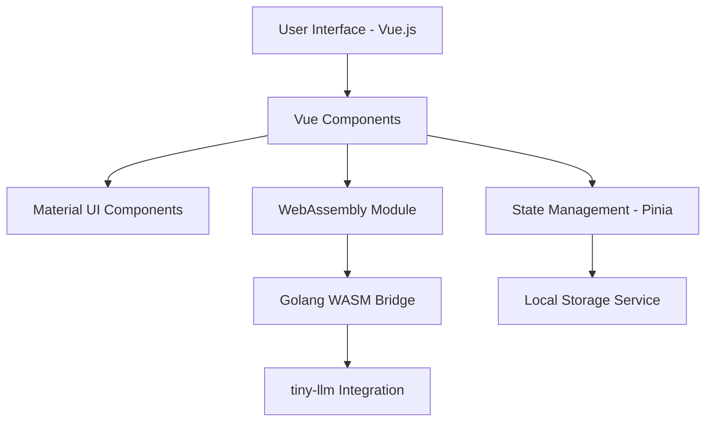
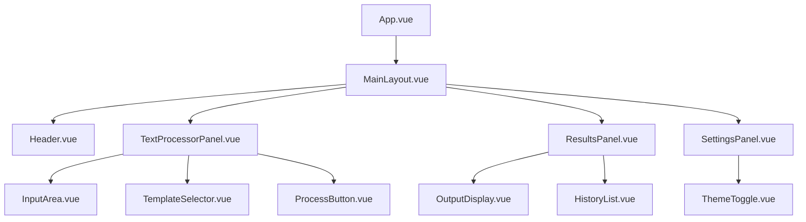

# Detailed Plan: Vue.js + WebAssembly Text Processing Application

## 1. Project Architecture



## 2. Component Structure



## 3. Implementation Plan

### Phase 1: Project Setup and Basic UI (2-3 days)

1. **Initialize Vue.js project with Vite**
   - Set up the project structure
   - Configure build tools and dependencies
   - Implement basic routing

2. **Integrate Material UI components**
   - Install Vuetify (Material Design framework for Vue)
   - Configure theme settings
   - Set up responsive layouts

3. **Create core UI components**
   - Implement the main layout
   - Create input area with placeholder text
   - Build template selector dropdown
   - Design the transform button with animations
   - Develop results display area

### Phase 2: WebAssembly Integration (3-4 days)

1. **Set up Golang development environment**
   - Configure Go for WebAssembly compilation
   - Create basic Go module structure

2. **Develop WASM bridge**
   - Implement JavaScript to Go communication
   - Create Go functions for text processing
   - Set up error handling and type conversions

3. **tiny-llm Integration**
   - Implement tiny-llm library bindings in Go
   - Create wrapper functions for model loading and inference
   - Optimize for smallest models and quick responses

### Phase 3: Application Logic and Features (2-3 days)

1. **Implement prompt templates**
   - Create template definitions for:
     - Text summarization
     - Question answering
     - Creative writing

2. **Develop state management**
   - Set up Pinia store for application state
   - Implement actions and mutations for text processing
   - Create selectors for UI state

3. **Add loading indicators and error handling**
   - Implement loading spinners during processing
   - Create error handling middleware
   - Design user-friendly error messages

### Phase 4: User Experience Enhancements (2 days)

1. **Implement local storage integration**
   - Create service for storing recent inputs
   - Implement history management
   - Add functionality to reuse previous inputs

2. **Add dark/light mode toggle**
   - Implement theme switching
   - Create persistent theme preference
   - Design smooth transition animations

3. **Responsive design refinements**
   - Test on various device sizes
   - Implement breakpoints for different screen sizes
   - Optimize touch interactions for mobile

### Phase 5: Testing and Optimization (2 days)

1. **Performance testing**
   - Measure and optimize load times
   - Profile WebAssembly execution
   - Implement lazy loading where appropriate

2. **Cross-browser testing**
   - Ensure compatibility with major browsers
   - Fix any browser-specific issues
   - Optimize for mobile browsers

3. **Final optimizations**
   - Bundle size optimization
   - Code splitting
   - Image and asset optimization

## 4. Technical Stack

- **Frontend Framework**: Vue.js 3 with Composition API
- **Build Tool**: Vite
- **UI Framework**: Vuetify (Material Design for Vue)
- **State Management**: Pinia
- **WebAssembly**: Go compiled to WASM
- **LLM Integration**: tiny-llm
- **Testing**: Vitest and Cypress
- **Styling**: SCSS with Material Design variables

## 5. File Structure

```
vibejam/
├── public/
│   ├── models/            # LLM model files
│   └── favicon.ico
├── src/
│   ├── assets/            # Static assets
│   ├── components/        # Vue components
│   │   ├── layout/
│   │   ├── input/
│   │   ├── output/
│   │   └── settings/
│   ├── composables/       # Vue composables
│   ├── stores/            # Pinia stores
│   ├── services/          # Service layer
│   │   ├── storage.js
│   │   └── wasm.js
│   ├── styles/            # Global styles
│   ├── utils/             # Utility functions
│   ├── views/             # Page components
│   ├── App.vue            # Root component
│   └── main.js            # Entry point
├── wasm/
│   ├── go.mod             # Go module definition
│   ├── go.sum             # Go dependencies
│   ├── main.go            # Main Go file
│   ├── llm/               # tiny-llm integration
│   └── Makefile           # Build scripts
├── index.html             # HTML entry point
├── vite.config.js         # Vite configuration
├── package.json           # NPM dependencies
└── README.md              # Project documentation
```

## 6. Key Challenges and Solutions

### Challenge 1: WebAssembly and tiny-llm Integration
**Solution**: Create a clean API boundary between JavaScript and Go code, with clear type definitions and error handling. Use a message-passing architecture for asynchronous operations.

### Challenge 2: Performance Optimization
**Solution**: Implement worker threads for WebAssembly execution to prevent UI blocking. Use streaming responses from the LLM when possible to improve perceived performance.

### Challenge 3: Mobile Responsiveness
**Solution**: Design mobile-first using Vuetify's responsive grid system. Implement touch-friendly UI elements and optimize layout for smaller screens.

### Challenge 4: Model Loading and Management
**Solution**: Implement progressive loading of models with clear user feedback. Cache models in IndexedDB when possible to improve subsequent load times.

## 7. Testing Strategy

1. **Unit Testing**: Test individual components and services using Vitest
2. **Integration Testing**: Test component interactions and state management
3. **E2E Testing**: Use Cypress to test full user flows
4. **Performance Testing**: Measure and optimize load times and processing speed
5. **Cross-browser Testing**: Ensure compatibility across major browsers

## 8. Deployment Considerations

1. **Static Hosting**: The application can be deployed on any static hosting service
2. **CDN Integration**: Use a CDN for serving model files efficiently
3. **Caching Strategy**: Implement appropriate caching for models and static assets
4. **Analytics**: Add optional analytics for usage tracking